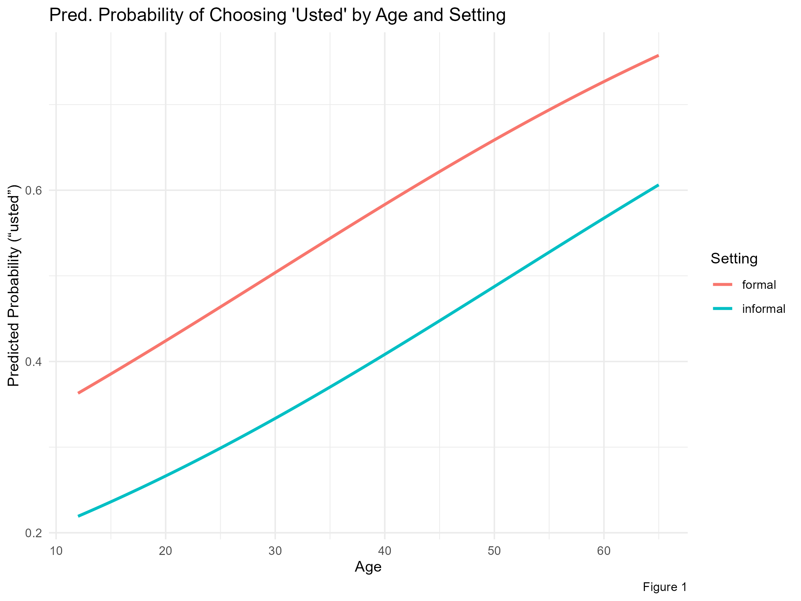

#######

# Methods
We set out to examine whether the choice of ustedeo and voseo is affected by setting (formal and informal) and age (old and young). Nested logistic regression models were used for the binary choice of ustedeo and voseo, while age and context were the fixed effects. The family was binomial and with a logit link function. The first model tested only the effect of setting, while second model the effect of age. The third model tested the addition of setting and age, and lastly, model 4 tested the interaction of setting and age. 

# Results

In the first model, we tested the uses of ustedeo and voseo by setting. It showed that "vos" is more likely in informal settings compared to formal settings. The larger coefficient estimate of "vos" was more likely to be used in informal contexts (estimate = 0.666) than in formal contexts (estimate = -0.168), and this  difference was significant (p = < .001).Then, in the second model, the effect of age was tested. Older participants were more likely to choose "usted" as the coefficient shows (estimate = 1.26), and younger participants showed a smaller coefficient (estimate = -0.03). (p < 0.001). 

Model 3 showed us that informal settings still significantly reduced the odds of using "usted" (estimate = -0.71, p < 0.001), while age continued to increase the odds (estimate = 0.032, p < 0.001). Both setting and age independently contributed to explaining variation in "usted" use.

```{r, echo=FALSE}

```

Finally, Model 4 tested whether the effect of age depended on setting. These were our findings:
    • The main effects remained: informal settings reduced "usted" use, and age increased it.
    • The interaction term (settinginformal:age) was not statistically significant (p = 0.17), meaning there was no strong evidence that the effect of age differed between formal and informal settings.
Figure 4 shows the interaction between setting and age, showing predicted probabilities of ‘usted’ use for different combinations of these predictors.

```{r setup papaja, include=FALSE}
library(papaja)  # Loads citation functions
```


